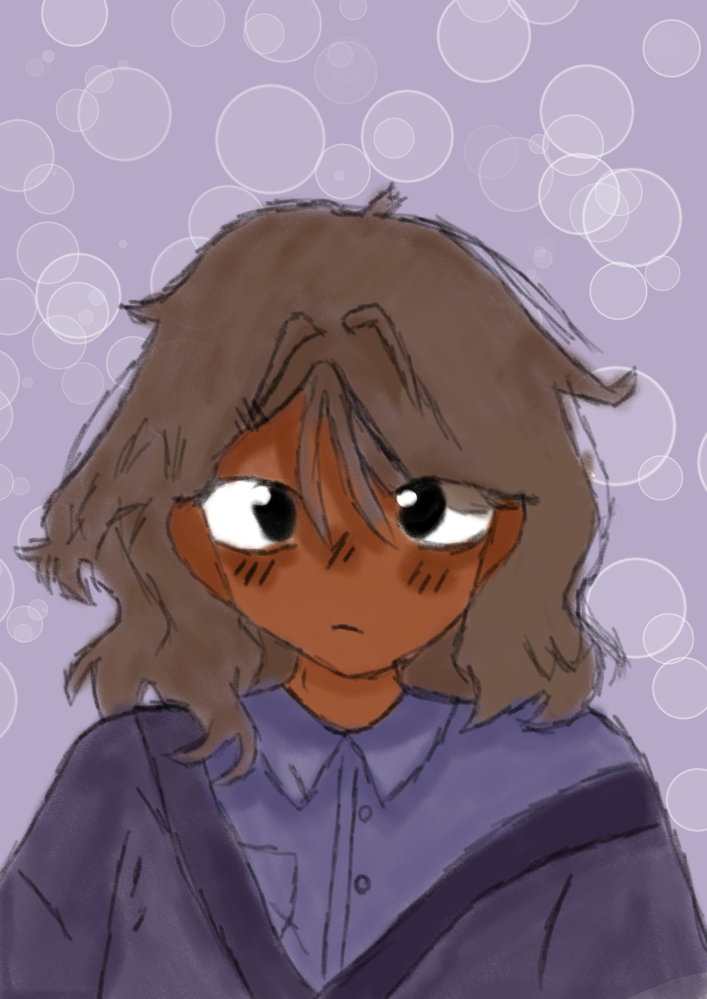

<!-- GitHub Profile README -->

<h1 align="center">Eae, me chamo Marchetti 👋</h1>
<h3 align="center">Estudante | Desenvolvedor | Animador</h3>

## 🎨 artes

  
  
  

## ☺️ Sobre mim

Tenho 17 anos e sou um estudante da Escola Profissional de Aveiro do curso de gestão e progrmação de sistemas informáticos (GPSI).
Também gosto bastante de fazer artes e animações

- 🎓 Estudante do ensino secundário, focado em **gestão e programação de sistemas informáticos**  
- 🎨 Também curto **design gráfico** e **edição de vídeo**  
- 🚀 Sempre tentando evoluir um pouco a cada projeto e desafio
##
🛠️ Tecnologias & Ferramentas

  
  
  
  
  

## 📌 Projetos em Destaque

- 🔹 **teste de Animação** – Uso de todos os conhecimentos sobre animação para aprender ainda mais e aperfeiçoar técnicas 
- 🔹 **Animação com os amigos** – depois de aprendizados e aperfeiçoamento. um pequeno projeto de animação com os meus amigos de sala
- 🔹 **Elegrow** – Jogo sobre uma plantação

## 🌐 Onde me encontrar
- 💼 GitHub: https://github.com/VT-Marchetti
- 💬 Discord: vt_marchetti 
- 📫 Email: davilainemarchetti08@gmail.com

⭐⭐⭐

